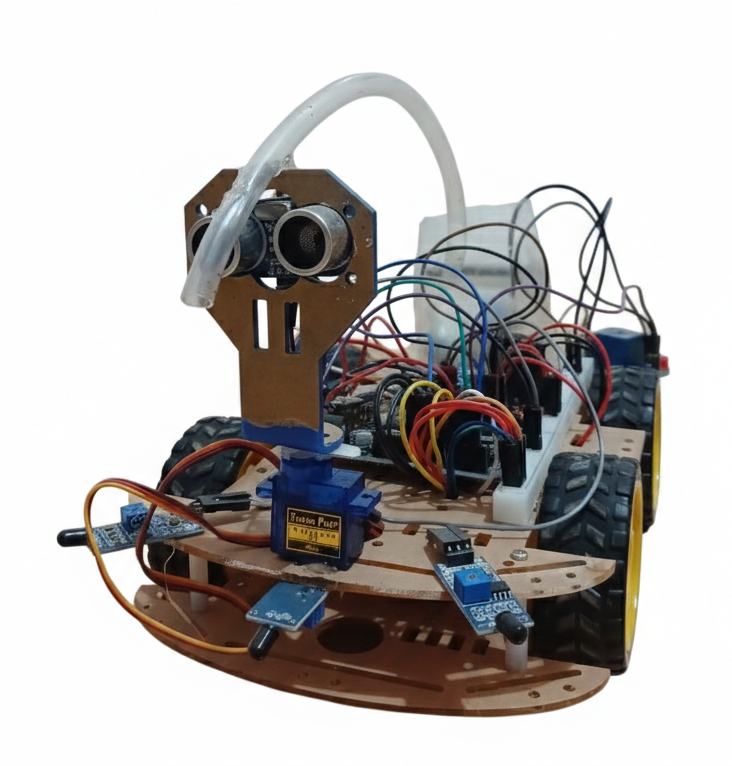
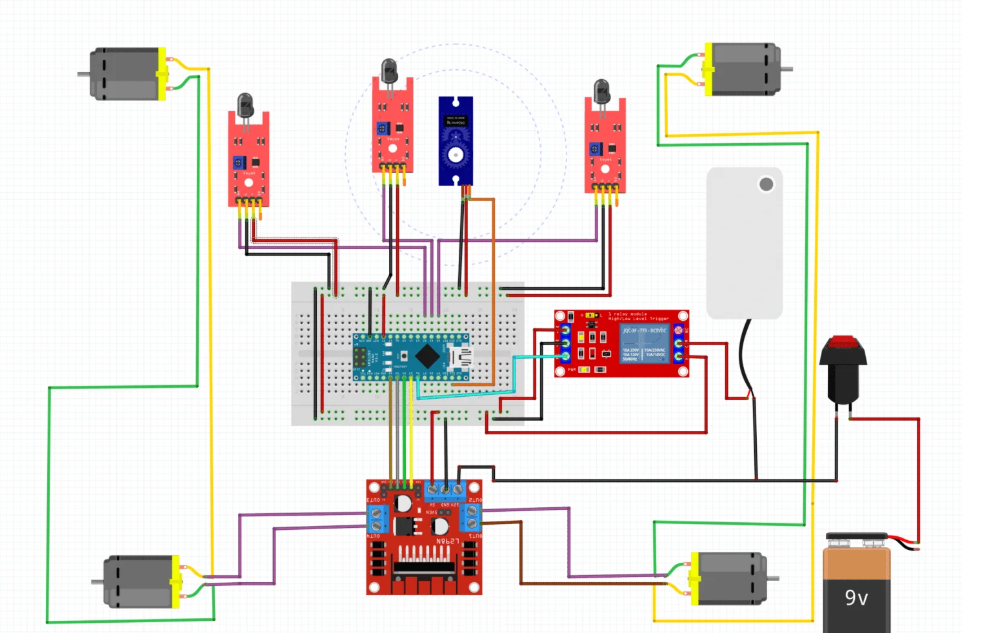

# 🚒 ObstacleFire-Robot
An intelligent autonomous system for real-time fire detection and suppression, featuring obstacle avoidance.

## 🧠 Smart Features
* **Tri-Directional Flame Sensing:** Uses 3 IR sensors with an analog smoothing algorithm for precise fire localization.
* **Dynamic Servo Spraying:** Implements a `shakeServo()` function to oscillate the water hose for maximum coverage.
* **Intelligent Obstacle Avoidance:** Integrated Ultrasonic HC-SR04 logic to navigate safely within 20cm of obstacles.

## 📸 Project Preview

## 🔌 Circuit & Wiring Diagram
To ensure stability, the power for the motors is isolated using 18650 batteries, and the sensors are mapped as follows:

### 📍 Pin Mapping Reference:
* **Ultrasonic Sensor:** Trig (A3), Echo (A4).
* **Flame Sensors:** Left (A0), Center (A1), Right (A2).
* **Actuators:** Pump Relay (D7), Hose Servo (D3).
* **Motor Driver (L298N):** Pins 5, 6, 9, 10.

## 🛠️ Hardware Setup
* **Microcontroller:** Arduino Uno.
* **Sensors:** Ultrasonic HC-SR04, 3x IR Flame Sensors.
* **Drive:** L298N Motor Driver with dual DC motors.
* **Suppression:** Water Pump via Relay and Servo-mounted hose.
